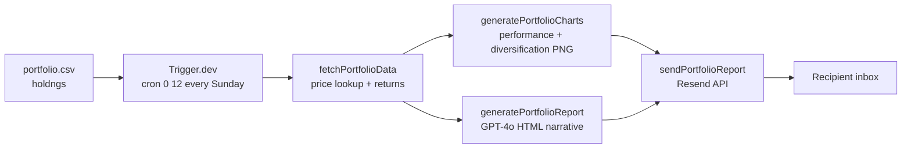

# Portfolio Insight Engine

A scheduled pipeline that reads your stock holdings from a CSV, fetches current prices, generates an AI-written performance narrative, and emails you a report every Sunday. No dashboard to check, no spreadsheet to update — it just shows up in your inbox with a performance summary, two charts, and a short analysis of what moved and why.

The pipeline runs as a Trigger.dev scheduled task (`0 12 * * 7` — Sundays at noon UTC). It fetches price data for each ticker, computes week-over-week returns and portfolio allocation, generates charts for performance and diversification, builds an HTML email with GPT-4o, and sends it via Resend. The task uses `payload.timestamp` for the reference date so the reported period is always the correct week, regardless of the server's local clock.

## Features

- **Trigger.dev cron scheduling** — `0 12 * * 7` fires every Sunday at 12:00 UTC with a 5-minute max duration; retries and run history visible in the Trigger.dev dashboard
- **Holdings CSV input** — reads ticker symbols, share counts, and average cost from `portfolio.example.csv`; no database required, just edit the file and redeploy
- **Live price fetching** — pulls current price and weekly price history per ticker at job runtime
- **Week-over-week performance calculation** — computes gain/loss per holding in both absolute value and percentage against the prior week's close
- **Performance chart** — bar chart showing each position's week-over-week return, buffered as PNG and attached to the email
- **Diversification chart** — pie/donut chart showing portfolio allocation by ticker at market value, also PNG-attached
- **GPT-4o report generation** — reads the full portfolio snapshot and writes a human-readable narrative: top movers, sector notes, overall portfolio performance, and brief commentary
- **Resend HTML email delivery** — styled HTML email with embedded chart attachments sent to the configured recipient
- **Data issues tracking** — holdings with failed price lookups are collected in `report.dataIssues` and excluded from calculations rather than crashing the job

## Tech Stack

| Layer | Technology |
|---|---|
| Scheduling | Trigger.dev v3 |
| AI | OpenAI GPT-4o |
| Email | Resend |
| Language | TypeScript 5 |
| Runtime | Node.js 20+ |

## Setup

```bash
git clone https://github.com/isidhartha/portfolio-insight-engine.git
cd portfolio-insight-engine
npm install
cp .env.example .env
```

Fill in `.env`:

```
OPENAI_API_KEY=sk-...
RESEND_API_KEY=re_...
RESEND_TO=you@example.com
TRIGGER_SECRET_KEY=tr_...
```

Edit `portfolio.example.csv` with your holdings:

```csv
ticker,shares,avg_cost
AAPL,50,172.30
MSFT,20,415.00
NVDA,10,880.50
```

Start the Trigger.dev dev server:

```bash
npx trigger.dev@latest dev
```

The `portfolio-weekly-report` task appears in the Trigger.dev dashboard where you can also trigger it manually to test.

## Architecture



## Demo

> Email report screenshots coming soon. Trigger the job manually from the Trigger.dev dashboard to see it run.

## Contributing

See [CONTRIBUTING.md](CONTRIBUTING.md) for guidelines.

## License

MIT

## Author

[isidhartha](https://github.com/isidhartha)
