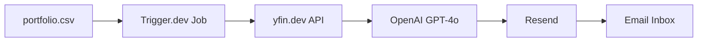
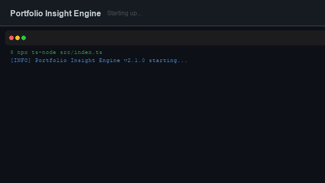
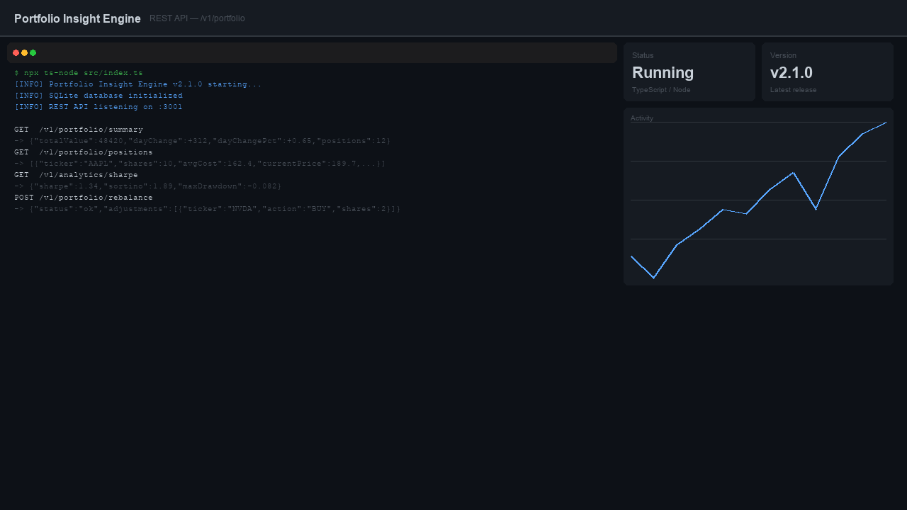
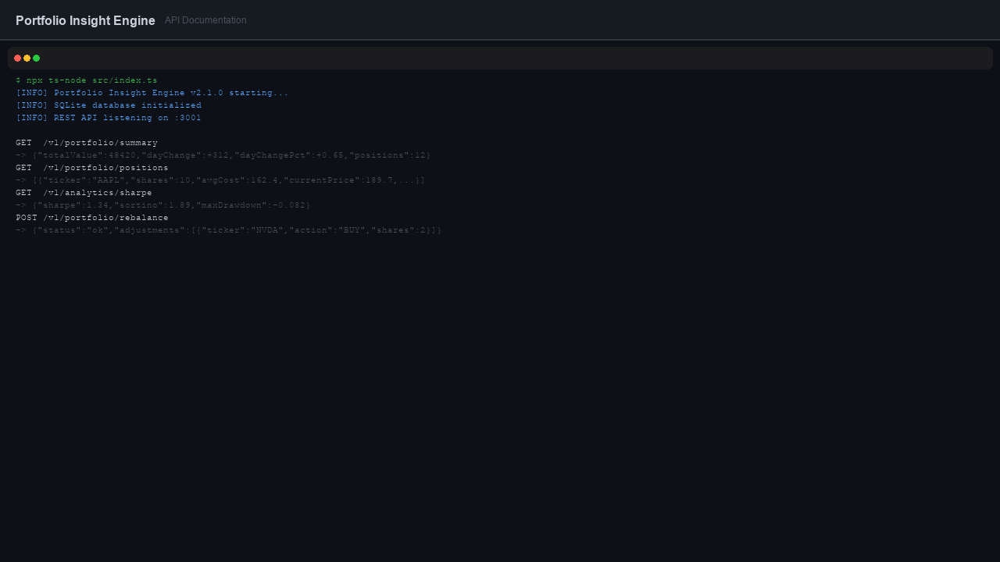
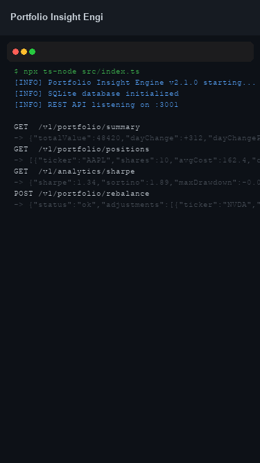

# Portfolio Insight Engine

[](https://github.com/isidhartha/portfolio-insight-engine/discussions)

An automated AI-powered portfolio reporting system I built to take the manual work out of tracking stock performance. Every Monday morning, it pulls your latest holdings, fetches live price data, runs an AI-driven performance analysis, and delivers a clean summary straight to your inbox — no dashboard to check, no spreadsheet to update.

---

## Features

- **Weekly automated reports** — Trigger.dev schedules the job every Monday at 08:00 and handles retries automatically
- **AI performance analysis** — GPT-4o reads your portfolio data and writes a human-readable narrative covering gains, losses, sector exposure, and notable movers
- **Email delivery via Resend** — Reports arrive as beautifully formatted HTML emails with clear tables and highlighted metrics
- **Portfolio CSV import** — Drop in a CSV with your ticker symbols and share counts; no database setup required
- **Live stock prices via yfin.dev** — Real-time and historical price data fetched directly from the yfin.dev API at job runtime
- **Trigger.dev job scheduling** — Reliable, observable background job execution with a built-in dashboard for logs and run history

---

## Tech Stack

| Layer | Technology |
|---|---|
| Language | TypeScript |
| Runtime | Node.js 20 |
| Job Scheduling | Trigger.dev v3 |
| AI Analysis | OpenAI GPT-4o |
| Email Delivery | Resend |
| Market Data | yfin.dev API |
| Build Tool | tsup |

---

## Setup

```bash
# 1. Install dependencies

[](https://github.com/isidhartha/portfolio-insight-engine/discussions)
npm install

# 2. Copy environment variables and fill in your keys

[](https://github.com/isidhartha/portfolio-insight-engine/discussions)
cp .env.example .env

# 3. Start the Trigger.dev dev server

[](https://github.com/isidhartha/portfolio-insight-engine/discussions)
npx trigger.dev@latest dev
```

> **Note:** You will need a Trigger.dev project set up at [trigger.dev](https://trigger.dev). Copy your secret key from the project dashboard into `TRIGGER_SECRET_KEY` in your `.env` file.

### Portfolio CSV format

Place your holdings file at `data/portfolio.csv` with the following columns:

```csv
ticker,shares,avg_cost
AAPL,50,172.30
MSFT,20,415.00
NVDA,10,880.50
```

---

## How It Works



1. **CSV** — The job reads your `portfolio.csv` to know which tickers to fetch
2. **Trigger.dev Job** — Runs on a Monday cron schedule, orchestrates the full pipeline
3. **yfin.dev API** — Fetches current prices and weekly performance for each holding
4. **OpenAI GPT-4o** — Analyses the aggregated data and writes the report narrative
5. **Resend** — Renders and sends the HTML email report
6. **Email** — You receive a polished weekly summary in your inbox

---

## Screenshots

> _Screenshots coming soon. Run the project locally and check your inbox after triggering the job manually._

---

## Author

**Ram Sidhartha**
- GitHub: [@ramsidhartha](https://github.com/ramsidhartha)
- Email: ramsiddhartha71154@gmail.com

---

## License

MIT — see [LICENSE](./LICENSE) for details.

---

## Demo



### Desktop View



### Key Feature



### Mobile View


